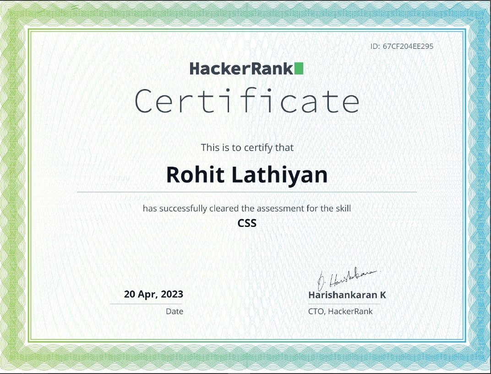
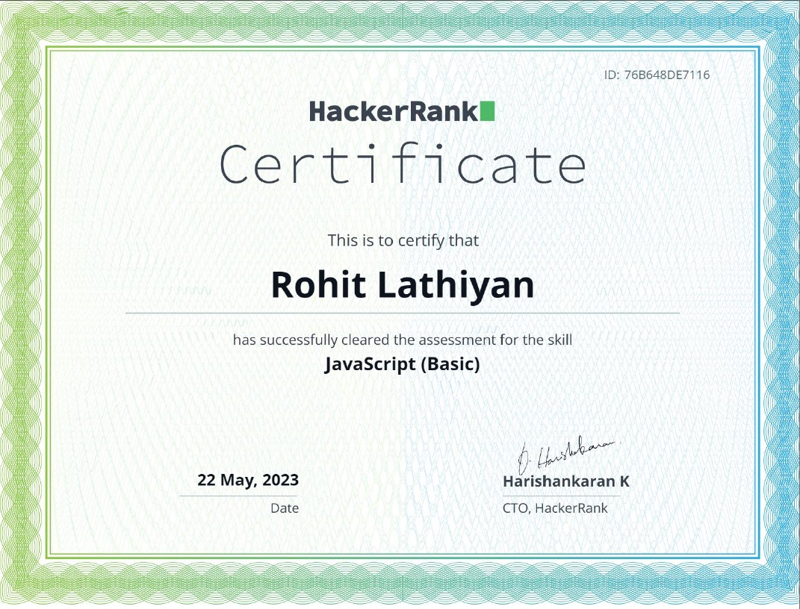
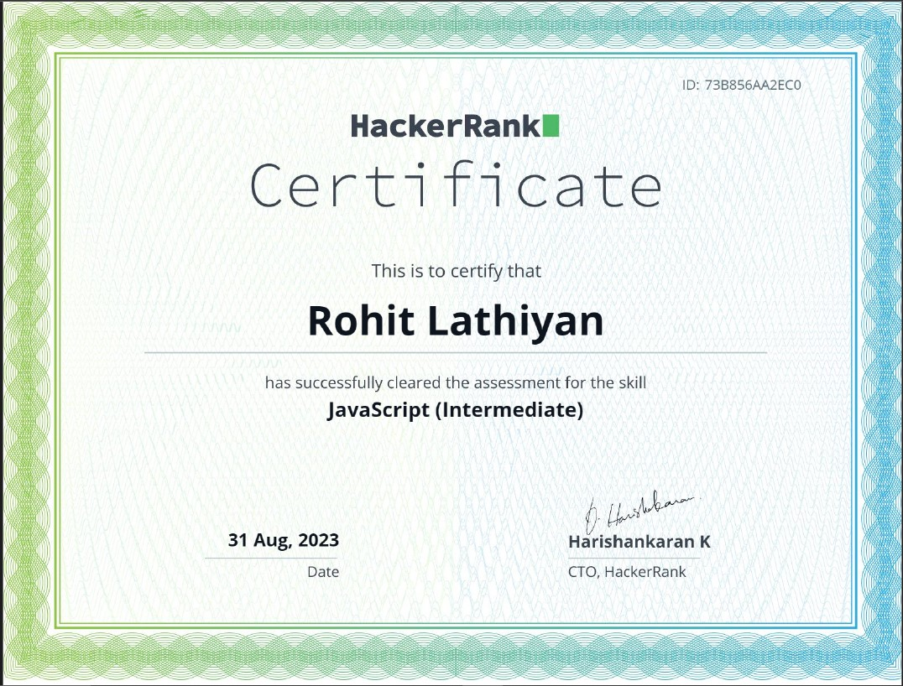
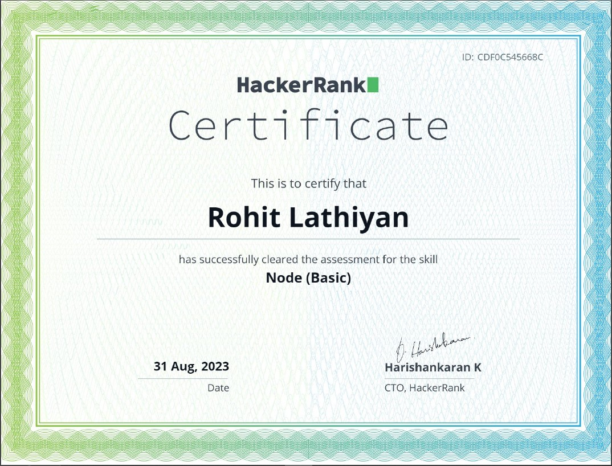

<h1 align="center">Hi 👋, I'm Rohit Lathiyan</h1>
<h3 align="center">A passionate about WEB DEVELOPMENT from India</h3>

  

  

- 🌱 I’m currently learning **react**

- 💬 Ask me about **html ,CSS ,Bootstrap,javascript,node**

- 📫 How to reach me **rohitlathiyan@gmail.com**

<h3 align="left">Connect with me:</h3>

<h3 align="left">Languages and Tools:</h3>

         
         
        
        
        
         

&nbsp;

