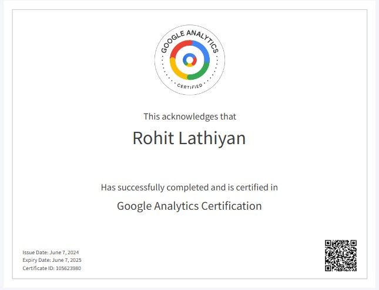
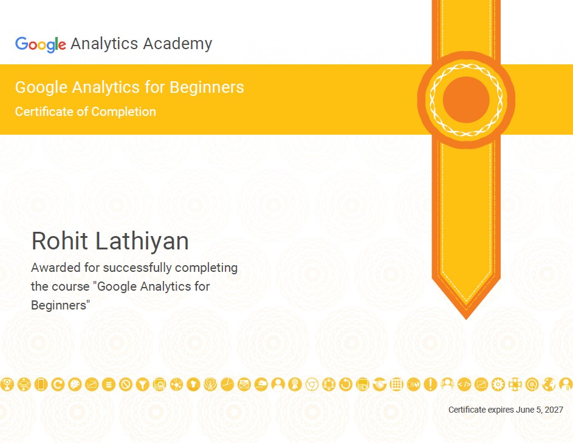

<h1 align="center">Hi 👋, I'm Rohit Lathiyan</h1>
<h3 align="center">Passionate SEO Analyst at HindSoft Technology, based in India. Eager to learn and excel in web technologies.</h3>

  

  

- 🌱 I’m currently learning **Digital Marketing**

- 💬 Ask me about **HTML ,CSS , Bootstrap , javascript ,  SEO-Specialization In PHP Site And also Work on Custom coded Website**

- 📫 How to reach me **rohitlathiyan@gmail.com**

<h3 align="left">Connect with me:</h3>

<h3 align="left">Languages and Tools:</h3>

         

&nbsp;

    

    

    

    

<!--     

 -->
<!--     

 -->

